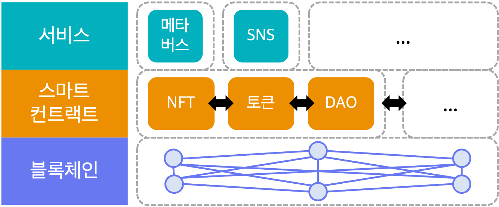
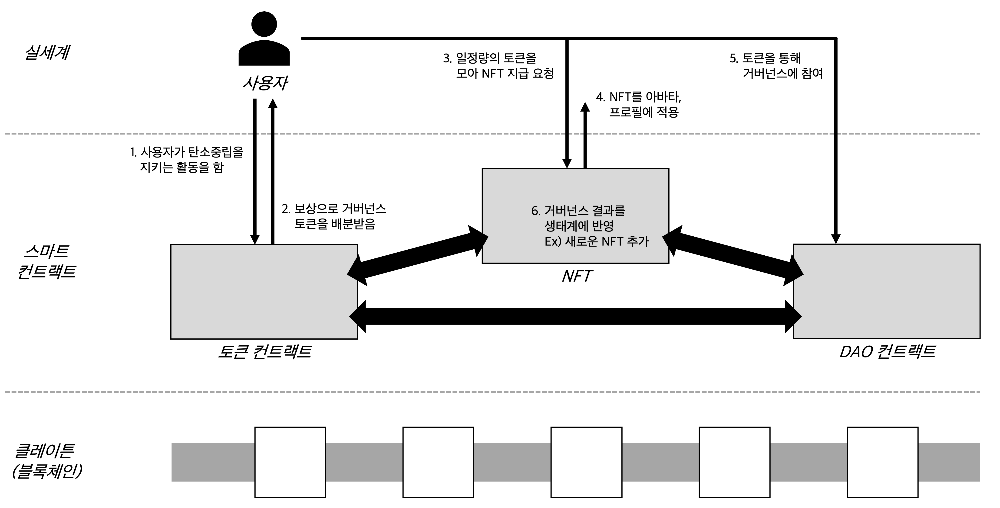

# When-Metaverse-Met-NFT

> 메타버스와 NFT를 이용한 MZ세대 환경참여 독려 솔루션

솔루션 참여자는 제페토에서 탄소중립을 준수하는 친환경 활동을 경험. 체험 컨텐츠에 따라 포인트를 모을 수 있는데, 일정량 이상의 포인트를 확보하면 NFT 형태의 증표를 획득. 해당 증표는 자신의 아바타 및 프로필에 적용할 수 있음. 또한 포인트는 솔루션의 의사결정에 사용될 수 있어 탄소중립에 힘쓰는 참여자일수록 솔루션에서의 영향력을 크게 행사할 수 있음.

# System Overview

- 블록체인 기술에 기반해 위변조할 수 없는 데이터로 신뢰할 수 있는 프로그램(스마트 컨트랙트) 수행이 가능.
- 스마트 컨트랙트로는 NFT증표 발행 및 관리를 위한 ‘NFT 컨트랙트’, 포인트 개념 구현을 위한 ‘토큰 컨트랙트’, 탈중앙화 환경에서 의사결정 및 집행을 위한 ‘DAO 컨트랙트’를 구현. 스마트 컨트랙트간 소통에는 제한이 없으므로 기능 확충이 용이함.
- 메타버스의 아이템 및 아바타, SNS 서비스의 프로필 등 NFT를 활용할 수 있는 서비스들과 스마트 컨트랙트를 연동. 스마트 컨트랙트의 연동에는 제한이 없으므로 추후 다른 서비스로의 확장이 용이함.

## Contracts

### MMN

NFT. TBA.

### vMMV

ERC20 token with some governance functionalities like voting, delegating, and so on. TBA.

### GovernorBravo Series and Timelock

Governance for DAO from Compound protocol.

### Rendezvous

- Propose new NFT.
- Claim NFT with enough rights, that is, governance tokens.
- Tagging whether NFT is used or not in real-world.

### Giver

- Propose new mission.
- Claim governance tokens when you finish your mission.
- Deposit needed.

# User Scenario

1. 사용자가 제페토에서 탄소중립을 준수하는 친환경 활동을 함.
2. ‘토큰 컨트랙트’를 통해 상응하는 양의 토큰이 발행됨. 토큰은 서비스 내에서 포인트와 같은 역할을 함.
3. 일정량 이상의 토큰을 보유한 사용자는 ‘NFT 컨트랙트’에 NFT증표 지급을 요청할 수 있음.
4. NFT증표를 지급받은 사용자는 해당 증표를 자신의 아바타 및 프로필에 적용할 수 있음. 사용자가 NFT증표를 소유했다는 사실은 블록체인에 담겨 위변조가 사실상 불가능함.
5. 토큰은 ‘DAO 컨트랙트’를 통해 거버넌스 참여에 활용할 수도 있음. 일정량 이상의 토큰을 보유한 사용자는 서비스 개선 안건을 제안할 수 있음. 각 사용자들은 자신이 보유한 토큰의 양에 따라 가중되는 투표에 참여할 수 있음.
6. 최종적으로 통과된 안건은 서비스에 반영되어 생태계를 개선. 가령 새로운 NFT증표의 추가, NFT증표 발행에 요구되는 토큰 개수 변경 등의 수행이 가능.

# Demo

## NFT Minting

